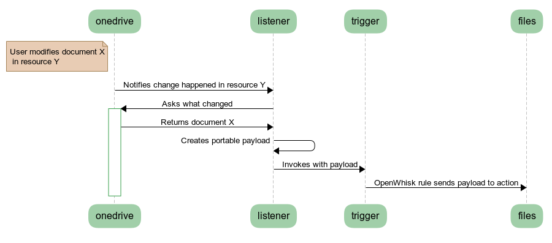

# Indexing in OneDrive

Indexing of documents in OneDrive happens in multiple runtime actions, called `helix-onedrive-listener` and `helix-index-files`. It leverages OneDrive [subscriptions](https://docs.microsoft.com/en-us/graph/api/subscription-post-subscriptions?view=graph-rest-1.0&tabs=http) and [change tracking](https://docs.microsoft.com/en-us/graph/api/driveitem-delta?view=graph-rest-1.0&tabs=http) for resources.

## Sequence



1. In an existing subscription, document X gets modified in OneDrive
1. OneDrive reports that a change was detected in resource Y
1. `helix-onedrive-listener` asks OneDrive what changed in resource Y
1. OneDrive reports back that document X changed
1. `helix-onedrive-listener` transforms the OneDrive specific change payload into a portable format
1. It invokes a trigger in the same namespace
1. That trigger is connected to one or more actions by OpenWhisk rules
1. One rule will invoke action `helix-index-files` with that payload
1. `helix-index-files` updates the index for document X

## Appendix A - Sequence Code
```
note left of onedrive: User modifies document X\n in resource Y
onedrive->listener: Notifies change happened in resource Y
listener->+onedrive: Asks what changed
onedrive->listener: Returns document X
listener->listener: Creates portable payload
listener->trigger: Invokes with payload
trigger->files: OpenWhisk rule sends payload to action
```